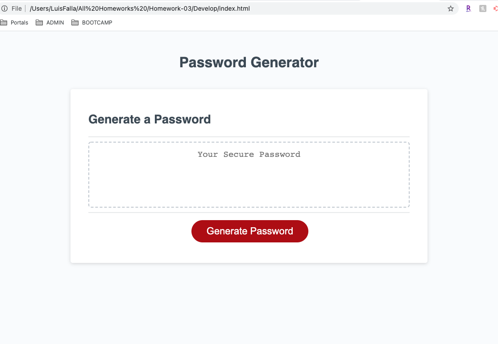

# Homework - JavaScript: Password Generator

## Link to site
* [Live Link](https://chronoslou.github.io/HW3/)

## Description

This week's assignment was to modify a started code to create an application that would generate random passwords based on a set list of criteria. The was around Javascript. The criteria for the app is the following:

* The app needs to be clean and polished.
* The app needs to be responsive tp the user interface and adapt to multiple screen sizes.
* The password recommendation/generation needs to include special characters. 

## Usage

The application provides the End User with the following information:

* The password recommendation is new each time the app is used.
* The button needs to trigger the sequence of events to generate a password.
* After the buttom is pressed, then a series of prompts needs to be executed and displayed to the end user through window pop ups. 
* After the 5th prompt, then the suggested password generated by the application will display to the end user. 

### Password Criteria and Prompts
* The initial prompt will ask how many character the password needs to be (at least 8 characters and no more than 128 characters).
* The 2nd prompt will ask if the password needs to include lowercase letters. 
* The 3rd prompt will ask if the password needs to include uppercase letters. 
* The 4th prompt will ask if the password needs to include numbers.
* The 5th prompt will ask if the password needs to include special characters. 

## Preview of App 

* This is how the app looks

 
